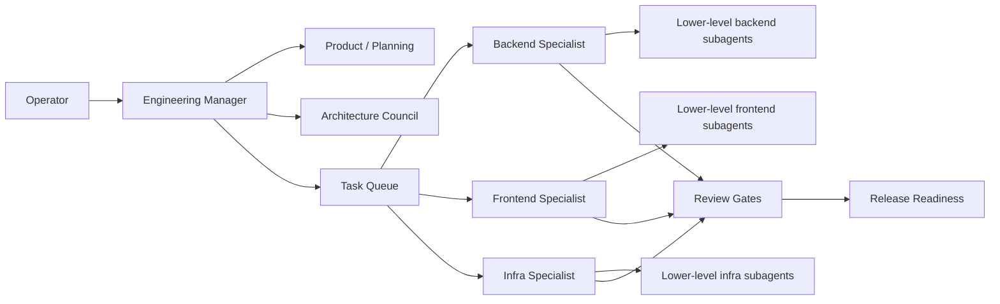
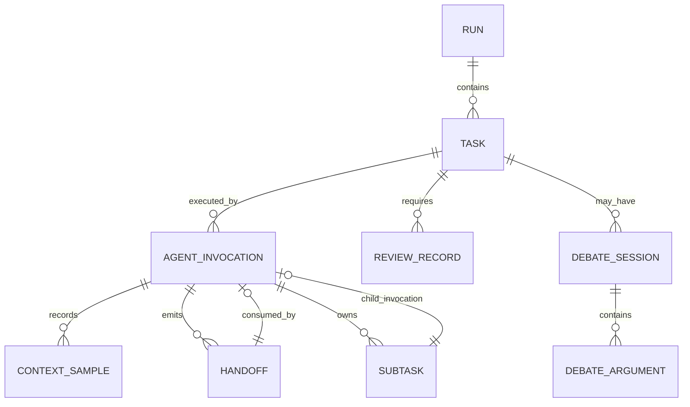
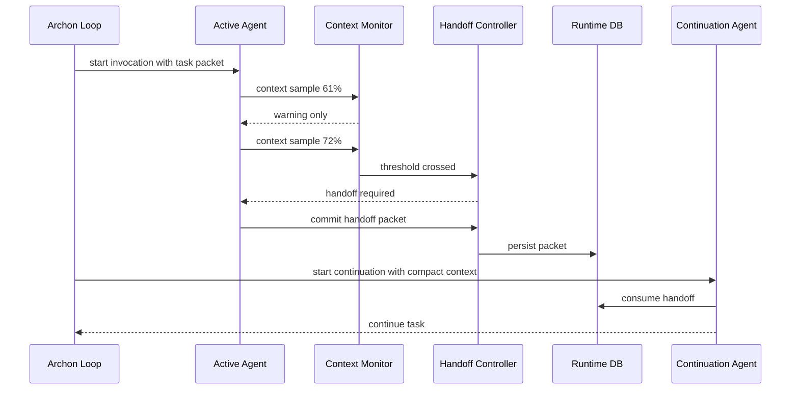
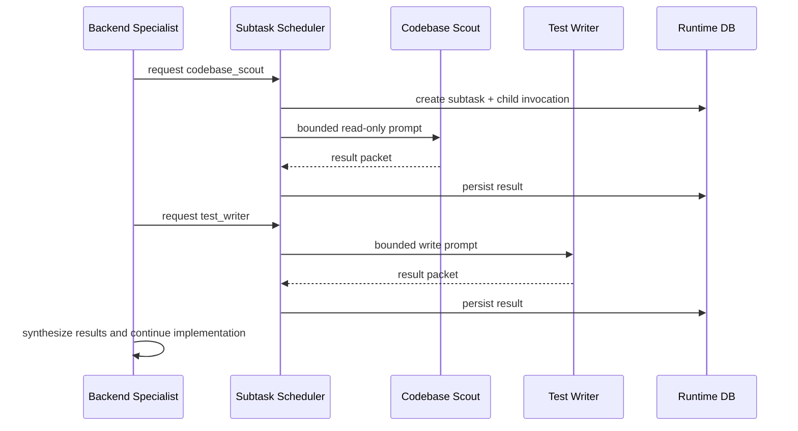
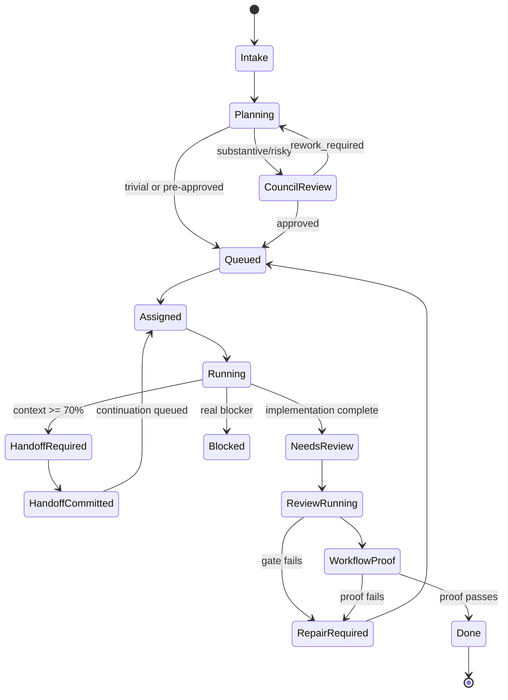

# Software Design Document: Archon as an Agentic Software-Company Runtime

**Status:** Proposed software design  
**Target project:** [`WitchyNibbles/archon`](https://github.com/WitchyNibbles/archon)  
**Date:** 2026-06-17  
**Primary user:** Developer/operator using Claude Code through Archon  
**Design theme:** Make Archon behave less like “Claude with a clipboard” and more like a managed engineering organization with task ownership, durable handoff, specialist execution, and review gates.

---

## 1. Purpose

Archon’s current direction is correct: model a software development company around Claude Code using managers, specialists, skills, runtime state, and review gates. The implementation is still too loose because too much depends on instructions and good behavior from the active model. A real software-company simulation needs durable work ownership, explicit state transitions, bounded delegation, review authority, and continuity across context windows.

This document defines the software behavior and user-facing design for evolving Archon into a stricter **agentic loop runtime**.

The key user request is implemented as follows:

> When any Archon-managed agent reaches 70% context usage, it must hand off work through a durable packet and continue through a fresh or resumed invocation. This rule applies equally to every role. Specialist agents may own lower-level subagents for bounded tasks.

---

## 2. Problem Statement

Archon wants to make Claude Code behave like a software development company. Today, it has many useful parts:

- managers
- specialists
- skills
- review gates
- task queue
- PostgreSQL runtime
- MCP server
- daemon loop
- checkpoint/resume

But the operator experience can still feel like ordinary Claude with more ceremony:

1. Agents may drift because role boundaries are advisory.
2. Long-running tasks degrade as context fills.
3. Handoff is not a universal runtime rule.
4. Specialist roles do not consistently decompose into lower-level workers.
5. Debate/council review exists conceptually but is not integrated as a structured decision primitive.
6. Runtime authority and markdown evidence can blur.
7. The root thread still risks becoming the “one giant agent that does everything,” which is exactly the cursed blob Archon is supposed to prevent.

---

## 3. Product Vision

Archon should become a **software-company control layer** over Claude Code:



The root manager does not implement the whole thing. It scopes, routes, synthesizes, enforces, and reports. Specialist owners implement or review work. Lower-level subagents do bounded investigation or execution. Runtime state decides what happens next.

---

## 4. Design Principles

| Principle | Meaning |
|---|---|
| Runtime over vibes | If a rule matters, store and enforce it. Prompt instructions alone are not enough. |
| Handoff before decay | At 70% context usage, stop normal work and transfer state before reasoning quality degrades. |
| Specialists own outcomes | A specialist can delegate bounded subtasks, but it remains accountable for synthesis and completion. |
| Subagents are scalpels, not interns with root access | Most subagents should be read-only, scoped, and short-lived. |
| Evidence beats confidence | Completion requires artifacts, tests, review records, and workflow proof. |
| Debate is selective | Use debate for high-risk decisions, not every CRUD edit. |
| Durable state is the authority | PostgreSQL runtime records decide run/task/review/handoff state. Markdown is evidence and export. |
| Root thread stays shallow | The manager coordinates; specialists do the work. |

---

## 5. User Experience Overview

### 5.1 Desired Operator Experience

The operator gives Archon a broad task:

```text
Implement multi-agent context handoff and specialist subagents.
```

Archon responds by:

1. creating or updating an active run
2. clarifying success criteria if necessary
3. creating a task plan
4. running architecture/design council if needed
5. assigning specialist owners
6. spawning bounded subagents for low-level work
7. enforcing context handoff at 70%
8. running review gates
9. advancing to the next task without being poked like a sleepy raccoon

### 5.2 Operator Commands

```bash
archon loop --context-threshold 70
archon status
archon context --task-id active
archon handoffs --task-id active
archon subtasks --task-id active
archon debate --task-id active --latest
archon report --run-id latest
```

### 5.3 Visible Status Example

```text
Run: run_20260617_agentic_loop
Active task: T3-context-handoff-runtime
Owner: agent_runtime_engineer
Context: 66% used, warning active
Subagents: 2 completed, 1 running
Latest handoff: none required yet
Review gates: pending
Next runtime action: continue owner invocation
```

At 70%:

```text
Run: run_20260617_agentic_loop
Active task: T3-context-handoff-runtime
Owner: agent_runtime_engineer
Context: 72% used
Runtime action: HANDOFF REQUIRED
Allowed actions: commit handoff packet, record checkpoint, stop
Blocked actions: edit, spawn subagent, start review
```

---

## 6. Functional Requirements

### 6.1 Agentic Loop

| ID | Requirement |
|---|---|
| FR-1 | Archon shall operate multi-phase work as a continuing loop unless complete, blocked, or user requested planning only. |
| FR-2 | Archon shall select the next unblocked task after each completed task. |
| FR-3 | Archon shall maintain active run/task pointers in runtime state. |
| FR-4 | Archon shall route tasks to specialist roles based on catalog metadata. |
| FR-5 | Archon shall keep root manager behavior shallow: intake, routing, synthesis, enforcement, final reporting. |

### 6.2 Universal Context Handoff

| ID | Requirement |
|---|---|
| FR-6 | Every Archon-managed agent invocation shall use the shared context policy. |
| FR-7 | Default handoff threshold shall be 70% context usage. |
| FR-8 | Once 70% is observed, the agent shall enter `handoff_required`. |
| FR-9 | In `handoff_required`, non-handoff work shall be blocked. |
| FR-10 | A valid handoff packet shall be persisted before normal work continues. |
| FR-11 | Continuation shall consume the latest relevant handoff packet. |
| FR-12 | Handoff shall work for root manager, specialist owners, reviewers, and subagents. |

### 6.3 Specialist Subagents

| ID | Requirement |
|---|---|
| FR-13 | Specialist agents may spawn lower-level subagents only if catalog policy allows it. |
| FR-14 | Subagents shall have bounded prompts, tools, write scopes, turn budgets, and output schemas. |
| FR-15 | Parent specialists shall synthesize subagent results and remain accountable. |
| FR-16 | Subagent results shall be persisted as runtime records. |
| FR-17 | Nested subagent depth and concurrency shall be capped. |

### 6.4 Debate and Council

| ID | Requirement |
|---|---|
| FR-18 | High-risk design decisions shall support Multi-Agent Debate. |
| FR-19 | Debate shall start with independent positions before cross-critique. |
| FR-20 | Every debate shall record at least one dissent or serious alternative. |
| FR-21 | Debate output shall include decision, conditions, vote, dissent, and evidence refs. |
| FR-22 | Debate shall not be mandatory for trivial or already-approved work. |

### 6.5 Review and Completion

| ID | Requirement |
|---|---|
| FR-23 | Substantive tasks shall require reviewer, QA, and security review gates. |
| FR-24 | Review records shall be runtime-authoritative. |
| FR-25 | Workflow proof shall fail if required context handoff records are missing. |
| FR-26 | Completion shall require evidence refs and successful gates. |

---

## 7. Non-Functional Requirements

| Category | Requirement |
|---|---|
| Reliability | Handoff records must survive session crashes and context compaction. |
| Safety | Agents must not obtain broader tools or write scope through subagent spawning. |
| Observability | Operators must see active role, context usage, handoff state, subtask status, and review gates. |
| Performance | Routine tasks should not trigger debate or excessive subagent fanout. |
| Cost control | Use smaller models for narrow, low-risk subtasks where appropriate. |
| Auditability | Every major decision, handoff, and review must be traceable to runtime records. |
| Backward compatibility | Existing commands and skills should continue to work during rollout. |

---

## 8. Conceptual Domain Model



### 8.1 Core Terms

| Term | Definition |
|---|---|
| Run | A product-level or project-level body of work. |
| Task | A bounded unit of work with scope, owner, acceptance criteria, and verification. |
| Agent invocation | One managed execution of a Claude agent/subagent for a task. |
| Specialist owner | Main role responsible for a task slice. |
| Subagent | Bounded lower-level worker spawned by a specialist. |
| Handoff | Durable transfer of active work state before context exhaustion or phase change. |
| Context sample | Runtime observation of context window usage. |
| Debate session | Structured multi-agent decision process with dissent and vote. |
| Workflow proof | Runtime evidence that a task satisfied required gates. |

---

## 9. Agent Organization Model

### 9.1 Layers

| Layer | Roles | Responsibility |
|---|---|---|
| Executive/root | Root manager thread | Intake, routing, enforcement, synthesis, reporting. |
| Management specialists | `planner`, `product_strategist`, `solution_architect` | Planning, acceptance, architecture. |
| Delivery specialists | `backend_engineer`, `frontend_designer`, `infra_engineer`, `agent_runtime_engineer`, etc. | Implementation and technical ownership. |
| Quality specialists | `reviewer`, `qa_engineer`, `security_reviewer`, etc. | Independent verification and gatekeeping. |
| Knowledge specialists | `docs_researcher`, `context_manager`, `memory_curator`, `technical_writer`, `git_operator` | Research, memory, docs, git hygiene. |
| Lower-level subagents | Role-specific bounded workers | Narrow subtasks with strict output packets. |

### 9.2 Ownership Rules

1. The root manager owns the run, not implementation details.
2. A specialist owner owns a task or task slice.
3. A lower-level subagent owns only its subtask.
4. A parent specialist must review/synthesize all child output.
5. Reviews must be independent from implementation ownership.
6. The runtime, not the active agent, decides completion authority.

---

## 10. Universal Handoff User Story

### Story

As an Archon operator, I want every agent to hand off work when context reaches 70%, so that long tasks remain coherent, recoverable, and auditable.

### Flow



### Acceptance

- Context crossing is visible in status.
- Agent cannot continue normal tool use after threshold.
- Handoff packet includes summary, evidence, touched paths, decisions, risks, and next actions.
- Continuation starts with compact context, not full transcript soup.

---

## 11. Specialist Subagent User Story

### Story

As a specialist agent, I want to spawn lower-level subagents for bounded work so that I can parallelize investigation and avoid polluting my main reasoning context.

### Example: Backend Engineer

```text
Parent: backend_engineer
Task: Add handoff persistence to PostgresStore
Subagents:
  - codebase_scout: read existing store patterns
  - migration_safety_checker: inspect migration impact
  - test_writer: add schema validation tests
```

### Flow



### Acceptance

- Parent role can only spawn allowed subagent types.
- Subagent prompt includes explicit stop condition.
- Subagent returns a validated result packet.
- Parent cites child evidence or rejects child output.

---

## 12. Multi-Agent Debate Design

### 12.1 Why Debate Exists

Debate is not there because “more agents” magically makes truth appear. That would be adorable. It exists because certain decisions benefit from independent framing, explicit dissent, and evidence comparison:

- architecture tradeoffs
- security boundaries
- risky migrations
- ambiguous product behavior
- conflicting review findings
- high-uncertainty debugging

### 12.2 Debate Modes

| Mode | Use |
|---|---|
| `independent_vote` | Fast check: multiple independent answers, then majority/synthesis. |
| `structured_debate` | 1–2 critique rounds with explicit dissent. |
| `council_review` | Formal architecture/product/security gate. |
| `red_team_review` | Security, abuse, failure-mode critique. |

### 12.3 Debate Stages

1. **Frame issue**  
   Topic, constraints, decision needed, evidence available.

2. **Independent positions**  
   Each participant answers without seeing others first.

3. **Cross-critique**  
   Participants critique assumptions, missing evidence, and risk.

4. **Dissent owner**  
   One role argues the best serious alternative.

5. **Vote**  
   Participants vote: approve, approve with conditions, rework, reject.

6. **Synthesis**  
   A judge/synthesizer writes the final decision and conditions.

7. **Persistence**  
   Runtime stores decision, dissent, vote, and evidence refs.

---

## 13. Multi-Agent Debate Results for This Design

The following debate is the design rationale used for this proposal.

### Debate A — Native Compaction vs Explicit Handoff

| Role | Position |
|---|---|
| Solution Architect | Native compaction is useful but not accountable. Use explicit handoff packet. |
| Agent Runtime Engineer | Handoff should be a runtime state transition, with hooks blocking non-handoff tools. |
| Context Manager | Continuation must receive compact curated state, not transcript residue. |
| Skeptical Dissent | Native compaction is cheaper to implement; explicit handoff adds complexity. |
| Decision | Use explicit handoff at 70%; native compaction is fallback only. |

**Reasoning:** Native compaction can preserve conversation continuity but does not create task ownership, touched paths, evidence refs, or next-action accountability. Handoff must be deliberate and durable.

### Debate B — Subagents vs Agent Teams vs Dynamic Workflows

| Role | Position |
|---|---|
| Product Strategist | Default behavior should be predictable for users. Avoid experimental teams by default. |
| Agent Runtime Engineer | Subagents fit specialist-owned bounded tasks. Dynamic workflows fit scripted fanout. |
| Cost Skeptic | Agent teams and debate can balloon tokens if used casually. |
| Solution Architect | Use a three-layer model: specialist owner, bounded subagents, optional dynamic workflows. |
| Decision | Default to specialist-owned subagents; use dynamic workflows for batch work; keep agent teams optional. |

**Reasoning:** Subagents preserve context and focus. Dynamic workflows are better for large scripted fanout. Agent teams may be useful later but should not be the default control path.

### Debate C — Should Every Specialist Have Subagents?

| Role | Position |
|---|---|
| Planner | Every recurring specialist should have a small menu of subagents. |
| Security Reviewer | Subagent spawning must be allowlisted and bounded. |
| Reviewer | Parent must synthesize and cannot blindly pass child output. |
| Skeptical Dissent | Too many subagents could create bureaucracy and slow work. |
| Decision | Give each specialist a small, role-specific subagent set with strict limits. |

**Reasoning:** Lower-level specialization is useful only when bounded. The catalog should avoid a Pokémon collection of agents nobody can supervise.

### Debate D — Debate Everywhere vs Selective Debate

| Role | Position |
|---|---|
| Product Strategist | Debate should improve important decisions, not slow routine delivery. |
| Security Reviewer | Security-sensitive work needs red-team debate. |
| QA Engineer | Ambiguous failures benefit from independent hypotheses. |
| Skeptical Dissent | Majority vote may be enough; debate can waste tokens. |
| Decision | Use debate selectively, with independent first answers and recorded dissent. |

**Reasoning:** Research suggests debate helps conditionally. Archon should use it as a quality gate, not as a personality disorder.

### Debate E — Prompt Discipline vs Runtime Enforcement

| Role | Position |
|---|---|
| Agent Runtime Engineer | Hooks, DB state, and MCP tools should enforce critical rules. |
| Reviewer | Workflow proof must fail missing handoff or review records. |
| Security Reviewer | Permissions must enforce tool access; instructions are not security controls. |
| Skeptical Dissent | Strict enforcement may reduce flexibility. |
| Decision | Enforce critical rules at runtime; allow scoped exceptions with recorded waivers. |

**Reasoning:** Agents are useful, not magical. Critical controls must survive model drift, prompt injection, context loss, and overconfident completion claims.

---

## 14. Task Lifecycle



---

## 15. Role-Specific Subagent Examples

### 15.1 `agent_runtime_engineer`

| Subagent | Tools | Write access | Output |
|---|---|---|---|
| `hook_contract_checker` | read, grep, MCP docs | none | hook constraints and risks |
| `mcp_tool_contract_checker` | read, typecheck | none or explicit files | tool schema findings |
| `runtime_trace_reader` | read logs/status | none | trace summary |
| `agent_prompt_linter` | read agent files | explicit `.claude/agents/**` only | prompt policy findings |

### 15.2 `backend_engineer`

| Subagent | Tools | Write access | Output |
|---|---|---|---|
| `codebase_scout` | read/search | none | implementation map |
| `api_contract_writer` | read/edit | explicit API files | contract patch summary |
| `test_writer` | read/edit/test | explicit tests | test evidence |
| `patch_writer` | read/edit | explicit task scope | patch packet |

### 15.3 `security_reviewer`

| Subagent | Tools | Write access | Output |
|---|---|---|---|
| `trust_boundary_mapper` | read/search | none | trust boundary map |
| `exploit_scenario_builder` | read/search | none | abuse cases |
| `secrets_scanner` | grep/read | none | secret exposure findings |
| `permission_policy_checker` | read | none | permission gap findings |

---

## 16. Handoff Packet UX

When context threshold is crossed, the agent sees a required handoff template:

```md
## Archon Handoff Required

Context used: 72%  
Reason: `context_threshold_70`  
Allowed actions: handoff only

Complete this packet:

### Summary
What changed or was learned?

### Evidence refs
What files, tests, logs, review records, or runtime records prove the current state?

### Decisions made
What should the next invocation not relitigate?

### Open questions
What remains unknown?

### Touched paths
What files were changed or inspected?

### Next actions
What should the continuation do first?

### Risks
What could break if the next invocation proceeds blindly?
```

Bad handoff:

```text
I worked on it. Continue.
```

Runtime response:

```text
Rejected: handoff packet missing evidence refs, touched paths, next actions, and decisions. Astonishingly, vibes are still not a persistence format.
```

---

## 17. Memory and Context Model

### 17.1 Memory Layers

| Layer | Purpose | Authority |
|---|---|---|
| PostgreSQL runtime | Active runs, tasks, handoffs, reviews, invocations | Authoritative |
| `.archon/work/` exports | Human-readable live work state | Evidence/export |
| `.archon/memory/` | Reviewed durable project facts | Authoritative for stable facts after promotion |
| Claude native project memory | Personal/session continuity | Advisory |
| Graph/retrieval systems | Discovery and recall | Advisory until reviewed |

### 17.2 Context Bundle

Before each invocation, `context_manager` builds a bounded bundle:

```json
{
  "task_packet": "current task scope and acceptance",
  "latest_handoff": "latest unconsumed handoff packet",
  "relevant_memory": "reviewed project facts only",
  "recent_evidence": "tests, logs, review records",
  "write_scope": "allowed paths",
  "open_risks": "current risks and blockers",
  "next_action": "runtime-selected instruction"
}
```

The bundle must be compact by design. The continuation should not ingest the entire previous transcript unless recovering from a crash.

---

## 18. Review and Release Model

### 18.1 Required Global Gates

Substantive work still requires:

1. `reviewer`
2. `qa_engineer`
3. `security_reviewer`
4. workflow proof

### 18.2 Targeted Specialist Gates

Additional gates may be required by task type:

| Task type | Additional gate |
|---|---|
| database migration | `database_specialist` |
| UI change | `accessibility_engineer`, optionally `frontend_designer` |
| performance-sensitive change | `performance_engineer` |
| release/package change | `release-readiness` |
| compliance-sensitive change | `compliance_reviewer` |
| runtime/hook/MCP change | `agent_runtime_engineer` |

### 18.3 Review Independence

A role that implemented a task cannot satisfy the independent review gate for that same task. Subagents cannot approve their parent. The runtime must preserve this separation because “I reviewed my own work and found it flawless” is not a quality process; it is a diary entry.

---

## 19. Operator-Facing Reports

### 19.1 Handoff Report

```md
# Handoff Report: task_456

- Total handoffs: 2
- Triggered by context threshold: 2
- Failed validations: 1
- Latest continuation owner: backend_engineer
- Current context: 38%

## Latest handoff
Summary: Added DB schema and store methods. Tests remain.
Evidence: migration file, unit test draft
Next actions: finish test assertions, run npm test, workflow proof
```

### 19.2 Debate Report

```md
# Debate Decision: Context handoff strategy

Outcome: approved_with_conditions
Vote: 4 approve, 1 reject
Dissent owner: cost_skeptic
Decision: explicit runtime handoff at 70%; native compaction fallback only.
Conditions:
- must block non-handoff tools after threshold
- must persist handoff packet before continuation
- must include workflow-proof check for missing handoffs
```

---

## 20. Safety and Permissions

### 20.1 Default Permission Stance

- Manager roles: can delegate and read; limited write.
- Delivery roles: can edit only declared task scope.
- Quality roles: read-heavy; write only review artifacts unless assigned repair work.
- Knowledge roles: read/research; memory writes require promotion policy.
- Subagents: least privilege by default.

### 20.2 Spawn Controls

Subagent spawn request must include:

- parent invocation ID
- subagent type
- task/subtask title
- bounded prompt
- allowed tools
- allowed write scope
- expected output schema
- max turns
- stop condition

Runtime denies spawn when:

- parent role cannot spawn that subagent type
- context threshold already crossed
- depth/concurrency cap exceeded
- write scope exceeds parent scope
- tool access exceeds parent permissions
- task is already in review/completion state

---

## 21. Product Rollout

### Stage 1 — Observe

- Record agent invocations and context samples.
- Do not block agents yet.
- Report what would have triggered handoff.

### Stage 2 — Warn

- At 60%, warning.
- At 70%, warning plus handoff recommendation.
- No hard enforcement.

### Stage 3 — Enforce Handoff

- At 70%, deny non-handoff tools.
- Require valid packet before continuation.
- Workflow proof checks handoff consistency.

### Stage 4 — Enable Specialist Subagents

- Enable catalog-approved subagents.
- Start with read-only scouts and checkers.
- Gradually allow scoped write-capable subagents.

### Stage 5 — Enable Debate Gate

- Architecture/product/security decisions use debate sessions.
- Reports include decision/dissent/vote.

### Stage 6 — Default Strict Mode

- `archon loop` uses enforced context handoff and specialist subagents by default.

---

## 22. Backward Compatibility

Existing Archon behavior should remain possible through feature flags:

```bash
ARCHON_CONTEXT_MONITOR=observe
ARCHON_HANDOFF_ENFORCEMENT=warn
ARCHON_SUBAGENTS=disabled
ARCHON_DEBATE_GATE=disabled
```

Existing skills and agents remain valid. The catalog is extended, not replaced.

---

## 23. Risks and Mitigations

| Risk | Impact | Mitigation |
|---|---|---|
| Context usage not observable equally in all Claude surfaces | Handoff may trigger late | Prefer SDK/stream wrapper for managed invocations; use statusline and PreCompact fallback. |
| Too many subagents increase cost | Slow/expensive runs | Use max depth, concurrency, and selective spawn rules. |
| Handoff packets become low-quality | Bad continuations | Schema validation, quality gate, examples, Stop hook enforcement. |
| Debate overused | Bureaucracy | Restrict to high-risk triggers. |
| Prompt injection through tools/MCP | Unsafe decisions | Treat tool output as evidence, not instruction; allowlist trusted tools. |
| Parent agent blindly trusts subagent | Wrong synthesis | Parent must cite, verify, or reject child output. |
| Runtime schema too complex | Maintenance burden | Add tables incrementally and keep command/report UX simple. |
| Users bypass Archon loop | No guarantees | Clearly define Archon-managed invocations as the support boundary. |

---

## 24. Success Metrics

| Metric | Target |
|---|---|
| Handoff compliance | 100% of managed invocations crossing 70% produce handoff or blocked state. |
| Completion integrity | 0 tasks marked complete without required gates. |
| Handoff usefulness | Continuation succeeds without rereading full transcript in >80% of cases. |
| Subagent containment | 0 unauthorized write-scope escapes. |
| Review defect rate | Fewer repeated review failures across similar tasks. |
| Operator intervention rate | Lower number of “continue” prompts required on multi-phase work. |
| Debate selectivity | Debate used only for configured high-risk triggers. |

---

## 25. Example End-to-End Scenario

### Task

Implement Archon context handoff runtime.

### Execution

1. Root manager creates run and task queue.
2. Planner decomposes into:
   - schema migration
   - context monitor
   - handoff controller
   - hooks
   - MCP tools
   - tests/evals
3. Solution architect runs council/debate.
4. `agent_runtime_engineer` owns runtime implementation.
5. It spawns:
   - `hook_contract_checker`
   - `mcp_tool_contract_checker`
   - `runtime_trace_reader`
6. Context reaches 71%.
7. Runtime blocks normal tools.
8. Agent commits handoff packet.
9. New `agent_runtime_engineer` invocation resumes from packet.
10. Implementation completes.
11. Review orchestrator runs reviewer, QA, security.
12. Workflow proof passes.
13. Task queue advances.

### Expected Result

The operator sees a completed task with:

- handoff history
- subagent result packets
- debate decision record
- tests
- review gates
- workflow proof

No mystical “trust me bro” completion. Civilization limps forward.

---

## 26. Glossary

| Term | Meaning |
|---|---|
| Agentic loop | Runtime cycle that repeatedly selects tasks, runs agents, records evidence, reviews, and advances. |
| Handoff packet | Durable summary and continuation contract emitted before context exhaustion or phase transition. |
| Specialist owner | Main role responsible for a task slice. |
| Subagent | Bounded lower-level worker spawned by a specialist owner. |
| Context threshold | Percentage of context window used; default handoff threshold is 70%. |
| Debate session | Structured multi-agent decision process with independent positions and dissent. |
| Workflow proof | Runtime verification that required completion conditions are satisfied. |
| Runtime authority | PostgreSQL records used as source of truth for work state. |

---

## 27. Final Design Summary

Archon should evolve in the direction it already implies:

- root manager stays shallow
- runtime owns state
- specialists own task slices
- lower-level subagents do bounded work
- handoff happens at 70% for every managed agent
- debate is selective and recorded
- review gates remain independent
- workflow proof decides completion

The architectural trick is not adding more agents. Any fool can spawn agents; several already have, and now we have a field of digital raccoons. The useful trick is making every agent accountable to the same runtime contract.

---

## 28. References

- Claude Code subagents: <https://code.claude.com/docs/en/sub-agents>
- Claude Code hooks: <https://code.claude.com/docs/en/hooks>
- Claude Code statusline: <https://code.claude.com/docs/en/statusline>
- Claude Code permissions: <https://code.claude.com/docs/en/permissions>
- Claude Code agent teams: <https://code.claude.com/docs/en/agent-teams>
- Claude Code dynamic workflows: <https://code.claude.com/docs/en/workflows>
- Claude Agent SDK agent loop: <https://code.claude.com/docs/en/agent-sdk/agent-loop>
- Model Context Protocol specification: <https://modelcontextprotocol.io/specification/2025-06-18>
- MCP architecture: <https://modelcontextprotocol.io/docs/learn/architecture>
- Du et al., *Improving Factuality and Reasoning in Language Models through Multiagent Debate*: <https://arxiv.org/abs/2305.14325>
- Michael et al., *Debate or Vote? Which Mechanism Yields Better Decisions in Multi-Agent Large Language Models?*: <https://arxiv.org/abs/2508.17536>
- Zhang et al., *Revisiting Multi-Agent Debate as Test-Time Scaling*: <https://arxiv.org/abs/2505.22960>
- Saha et al., *Diversity of Thought Elicits Stronger Reasoning Capabilities in Multi-Agent Debate Frameworks*: <https://arxiv.org/abs/2410.12853>
- *Recursive Agent Harnesses for Long Context Reasoning*: <https://arxiv.org/abs/2606.13643>
