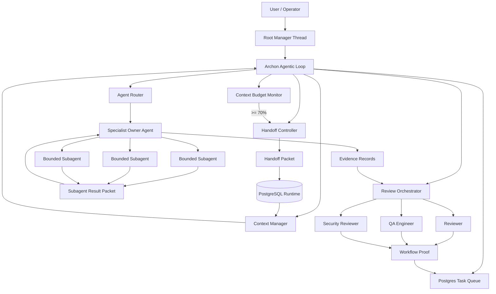
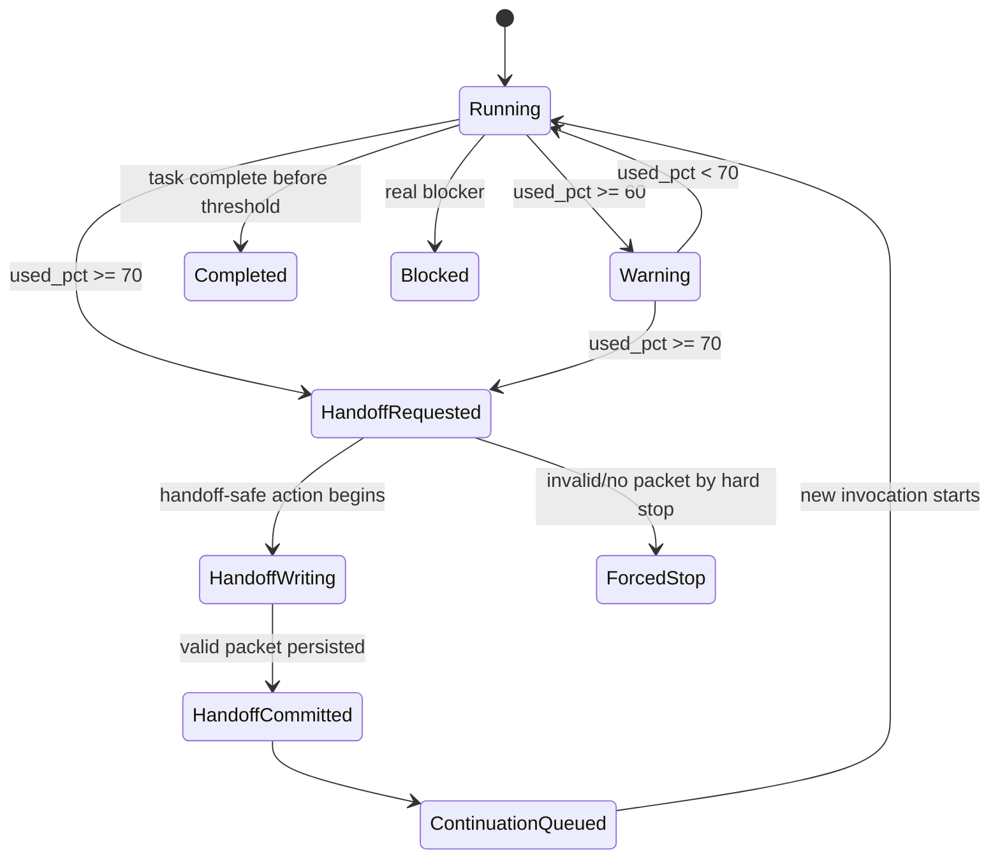
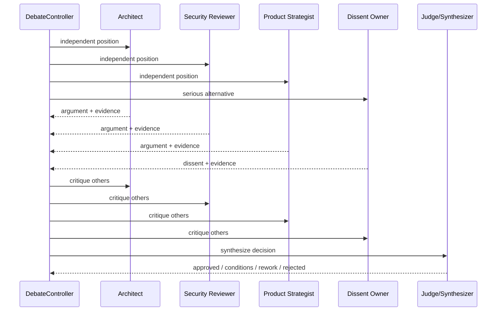

# Technical Design Document: Archon Agentic Loop, Context Handoff, and Specialist Subagents

**Status:** Proposed implementation design  
**Target project:** [`WitchyNibbles/archon`](https://github.com/WitchyNibbles/archon)  
**Date:** 2026-06-17  
**Primary focus:** Claude Code / Claude Agent SDK integration  
**Design intent:** Turn Archon from a loose Claude Code overlay into a runtime-governed agentic delivery loop with durable task ownership, universal context handoff, and specialist-subagent decomposition.

---

## 1. Executive Summary

Archon already contains the raw ingredients of an agentic software-company runtime: specialist agent definitions, workflow skills, a PostgreSQL-backed runtime, MCP tooling, review gates, checkpoint/resume support, and an existing daemon/loop command. The missing layer is stricter **runtime control**: agents must not merely be advised to behave like a software company; the runtime must own task assignment, context budgets, handoffs, subtask spawning, evidence capture, and review completion.

This design adds an **Archon Agentic Control Plane** with five core capabilities:

1. **Universal 70% Context Handoff**  
   Every Archon-managed agent invocation, regardless of role, is monitored by a shared context policy. At or immediately after the first observed `used_percentage >= 70`, the agent must stop normal work, emit a validated handoff packet, and resume through a fresh or compacted continuation invocation.

2. **Durable Handoff Packets**  
   Context handoff is not treated as Claude auto-compaction. It is a runtime event persisted in PostgreSQL with evidence refs, open decisions, touched files, remaining work, risks, and next actions.

3. **Hierarchical Specialist Subagents**  
   Existing specialist agents become task owners. They may spawn lower-level subagents for bounded work such as codebase scouting, test writing, migration planning, exploit sketching, performance profiling, or documentation source verification.

4. **Multi-Agent Debate as a Selective Gate**  
   Debate is used for high-risk design choices, ambiguous root-cause analysis, security-sensitive decisions, and architecture council review. It is not used for routine edits, because burning tokens so five agents can argue about a variable name is how civilizations decline.

5. **Runtime Enforcement Over Prompt Politeness**  
   Hook decisions, MCP tools, typed DB records, workflow proof, and permission boundaries enforce behavior. Agent instructions remain useful, but they are not the enforcement layer.

---

## 2. Current Archon Baseline

The existing repository already supports much of the proposed architecture:

| Existing capability | Observed design surface | Design implication |
|---|---|---|
| Specialist role catalog | `.claude/agents/*`, `src/archon/agent-catalog.ts` | Extend the catalog rather than inventing a parallel agent registry. |
| Workflow skills | `.claude/skills/*/SKILL.md` | Add a shared handoff skill and subtask skill. |
| PostgreSQL runtime | `workflow_runtime=postgres`, active run/task pointers | Store handoffs, invocations, context samples, debates, and subtasks in DB. |
| MCP server | `src/mcp/` and `@modelcontextprotocol/sdk` | Expose context, handoff, debate, and subtask tools to Claude. |
| Daemon loop | `archon:loop`, `src/daemon.ts` | Upgrade loop to own role execution and context replacement. |
| Review gates | reviewer, QA, security reviewer | Keep global gates; add targeted specialist gates. |
| Context manager role | existing `context_manager` | Make it responsible for context bundles before every continuation. |
| Review orchestrator role | existing `review_orchestrator` | Use it as the only trusted review-gate writer. |

Important current constraints:

- Archon’s role/model routing is currently advisory in `CLAUDE.md`; this design makes critical parts runtime-enforced.
- The daemon code still carries inherited “Codex” naming in places while invoking `claude -p`; this is cosmetic but confusing and should be cleaned up as part of the implementation.
- Existing checkpoint support already accepts compressed summaries and evidence refs; handoff should reuse and harden that path instead of building a second checkpoint swamp. 🐊

---

## 3. Source and Technology Basis

### 3.1 Claude Code Subagents

Claude Code subagents are specialized assistants with their own context window, custom system prompt, tool access, and configurable frontmatter such as `model`, `tools`, `maxTurns`, `skills`, `mcpServers`, `hooks`, `memory`, `effort`, and `isolation`. They preserve main-session context by operating in separate contexts.

Recent Claude Code behavior supports nested subagents when an agent has access to the `Agent` tool. Nested spawning should be deliberately allowlisted because unmanaged recursive trees are just fork bombs wearing a blazer.

### 3.2 Claude Code Hooks

Hooks can run at events such as `PreToolUse`, `PostToolUse`, `Stop`, `SubagentStop`, and `PreCompact`. These are suitable for enforcing handoff packets, blocking unsafe tool usage after a context threshold is crossed, recording subagent termination, and archiving context before native compaction.

### 3.3 Claude Agent SDK Loop

The Agent SDK exposes the same core execution loop as Claude Code: Claude evaluates the prompt, invokes tools, receives results, repeats until completion, budget exhaustion, or error. The SDK exposes context-window accumulation and compact boundaries. For strict context-budget enforcement across Archon-owned agents, the SDK or a Claude CLI stream wrapper should be preferred over relying on purely interactive Claude sessions.

### 3.4 Claude Statusline Context Usage

Claude Code statusline input includes `context_window.used_percentage`, `remaining_percentage`, and `current_usage`. The `used_percentage` value is based on input tokens. Archon should use the same input-token definition for consistency.

### 3.5 Agent Teams and Dynamic Workflows

Agent teams are useful for collaborative exploration and independent parallel work but are experimental, disabled by default, and carry higher token overhead. Dynamic workflows are better for scripted large-scale fanout, audits, migrations, and multi-agent cross-checking. This design uses ordinary subagents as the default, dynamic workflows for batch orchestration, and agent teams only as an optional future adapter.

### 3.6 MCP

MCP provides a standard protocol for exposing external tools, prompts, resources, and state to LLM hosts. Since MCP tool descriptions and server outputs can become part of model context, Archon must treat tool exposure as a security boundary: explicit allowlists, permission checks, audit logs, and no untrusted tool execution through broad agent permissions.

### 3.7 Multi-Agent Debate Research

Research on multi-agent debate suggests that independent answers, role diversity, critique rounds, and voting can improve some reasoning tasks. Later work also shows that debate benefits are conditional and often rivaled by simpler voting or self-consistency. Therefore Archon should apply debate selectively: design choices, safety-sensitive plans, high-uncertainty root cause analysis, and release-critical reviews.

---

## 4. Goals and Non-Goals

### 4.1 Goals

| Goal | Description |
|---|---|
| G1 | Enforce a universal context handoff threshold at 70% for every Archon-managed agent invocation. |
| G2 | Store all handoff state in PostgreSQL as durable, queryable, runtime-authoritative records. |
| G3 | Allow every specialist agent to spawn bounded lower-level subagents according to catalog policy. |
| G4 | Make Archon’s loop continue task execution until acceptance criteria, blocker, or review failure. |
| G5 | Use Multi-Agent Debate where it improves design quality, without making every task a committee meeting from hell. |
| G6 | Preserve existing review gates and runtime workflow proof. |
| G7 | Keep Claude Code native features usable while making Archon’s control layer stricter. |

### 4.2 Non-Goals

| Non-goal | Reason |
|---|---|
| Replacing Claude Code | Archon should remain an overlay/control plane. |
| Replacing existing skills/agents wholesale | Existing catalog is valuable; extend it. |
| Unbounded recursive agents | Must cap depth, concurrency, and budget. |
| Treating native auto-compaction as handoff | Auto-compaction summarizes context; handoff transfers accountable work ownership. |
| Making debate mandatory for all tasks | It creates cost and latency with little gain on routine work. |
| Supporting unmanaged manual Claude sessions | Universal guarantees apply to Archon-owned invocations. Manual side quests are out of contract. |

---

## 5. Key Design Decisions

| Decision | Choice | Rationale |
|---|---|---|
| Context threshold | `ARCHON_CONTEXT_HANDOFF_PCT=70` | Proactive handoff before native compaction and before context bloat degrades reasoning. |
| Enforcement layer | Runtime + hooks + MCP + DB | Prompt-only enforcement is decorative wallpaper. Pretty, but not structural. |
| Continuation model | Handoff packet + fresh/resumed invocation | Ensures durable work state independent of Claude transcript state. |
| Agent hierarchy | Root manager → specialist owner → bounded subagents | Mirrors software-company organization without collapsing into one giant omnivore agent. |
| Subagent default | Sequential/focused subagents | Lower overhead than experimental agent teams. |
| Batch fanout | Dynamic workflows | Better for audits, migrations, evals, and many independent checks. |
| Debate usage | Selective council/debate gate | Evidence suggests debate is useful conditionally, not universally. |
| Authority source | PostgreSQL runtime records | Markdown exports are evidence; DB is authority. |
| Review authority | Existing review orchestrator | Preserve reviewer/QA/security trust boundary. |

---

## 6. Proposed Architecture



### 6.1 Main Components

| Component | Responsibility |
|---|---|
| `AgenticLoopController` | Main run loop. Selects tasks, routes roles, monitors progress, advances queue. |
| `AgentInvocationRegistry` | Creates and tracks every Archon-owned agent/subagent invocation. |
| `ContextBudgetMonitor` | Records context samples and triggers handoff once threshold is reached. |
| `HandoffController` | Validates and persists handoff packets; prepares continuation prompts. |
| `SubtaskScheduler` | Allows specialist owners to spawn lower-level subagents within policy. |
| `ContextManager` | Builds context bundles from memory, DB, task packet, evidence, and handoff history. |
| `DebateController` | Runs selective independent critique/debate/vote sessions. |
| `ReviewOrchestrator` | Spawns trusted review trio and writes authoritative review records. |
| `PermissionGuard` | Applies role-specific tool permissions, write scope, nesting caps, and isolation requirements. |

---

## 7. Agent Invocation Model

Every Archon-managed agent invocation gets a runtime identity.

```ts
export interface AgentInvocation {
  invocationId: string;
  runId: string;
  taskId: string;
  parentInvocationId?: string;
  role: AgentRoleId;
  agentKind: "root_manager" | "specialist_owner" | "subagent" | "reviewer" | "debate_participant";
  model: "opus" | "sonnet" | "haiku";
  effort: "high" | "medium" | "low";
  status: "created" | "running" | "handoff_requested" | "handoff_written" | "completed" | "blocked" | "failed";
  contextPolicyId: string;
  startedAt: string;
  endedAt?: string;
}
```

### 7.1 Invocation Rules

1. No agent may own work unless an `agent_invocations` row exists.
2. No subagent may spawn unless its parent invocation exists and allows nested spawning.
3. Every invocation uses the same context policy unless explicitly overridden by runtime configuration.
4. Manual Claude sessions outside Archon do not count as managed invocations.

---

## 8. Universal Context Handoff Design

### 8.1 Context Policy

```ts
export interface ContextPolicy {
  policyId: string;
  handoffPct: number;          // default 70
  warningPct: number;          // default 60
  hardStopPct: number;         // default 80
  maxTurns?: number;
  maxOutputTokens?: number;
  appliesTo: "all_archon_agents";
}
```

Default environment:

```bash
ARCHON_CONTEXT_HANDOFF_PCT=70
ARCHON_CONTEXT_WARNING_PCT=60
ARCHON_CONTEXT_HARD_STOP_PCT=80
ARCHON_CONTEXT_SAMPLE_SOURCE=auto # sdk | statusline | transcript | auto
```

### 8.2 Threshold Semantics

Archon should trigger handoff **at or immediately after the first observable sample** where:

```ts
context_window.used_percentage >= ARCHON_CONTEXT_HANDOFF_PCT
```

Because Claude may only expose context usage at turn, hook, stream, statusline, or compact boundaries, exact interruption mid-token is not guaranteed in every surface. The guarantee Archon can enforce is stricter and more useful:

> Once the runtime observes `used_percentage >= 70`, the agent may only perform handoff-safe actions until a valid handoff packet is persisted.

Allowed after threshold:

- write/commit handoff packet
- record checkpoint
- record evidence refs
- ask for minimal scope expansion only if handoff cannot be written
- stop

Denied after threshold:

- arbitrary code edits
- broad reads unrelated to handoff
- spawning new subagents
- starting review gates
- continuing implementation because “just one more thing” — the ancestral cry of every broken build

### 8.3 Context Sample Sources

| Source | Use | Reliability |
|---|---|---|
| Claude Agent SDK stream | Preferred for Archon-owned programmatic invocations | High |
| Claude CLI `stream-json` wrapper | Existing daemon path; parse usage/result events where available | Medium-high |
| Claude Code statusline JSON | Useful for session-level monitoring | Medium |
| `PreCompact` hook | Last-resort archival before native compaction | High as fallback, late as trigger |
| Subagent transcript metadata | Useful for post-run audit and compact events | Medium |

### 8.4 Context Handoff State Machine



---

## 9. Handoff Packet Contract

A handoff packet is the minimum durable unit required to continue work safely.

```json
{
  "schema_version": 1,
  "handoff_id": "ho_20260617_001",
  "run_id": "run_123",
  "task_id": "task_456",
  "from_invocation_id": "ainv_backend_001",
  "from_role": "backend_engineer",
  "to_role": "backend_engineer",
  "reason": "context_threshold_70",
  "context_used_pct": 72,
  "status": "needs_followup",
  "summary": "Implemented the task queue migration and updated store methods. Remaining work is to add integration tests and run workflow proof.",
  "scope": {
    "allowed_write_scope": ["src/store/**", "src/sql/migrations/**", "tests/**"],
    "touched_paths": ["src/store/postgres-store.ts", "src/sql/migrations/009_agent_handoffs.sql"],
    "locked_paths": ["CLAUDE.md"]
  },
  "decisions": [
    {
      "decision": "Store handoffs as runtime-authoritative DB records, not markdown only.",
      "rationale": "Workflow proof already treats runtime as authority."
    }
  ],
  "open_questions": [
    "Should failed subagent packets be retryable or require parent-owner synthesis first?"
  ],
  "evidence_refs": [
    "migration:009_agent_handoffs.sql",
    "test:agent-handoff-schema.test.ts"
  ],
  "next_actions": [
    "Add tests for threshold transition.",
    "Run npm test and workflow-proof for task_456."
  ],
  "risks": [
    {
      "severity": "medium",
      "risk": "CLI stream may not expose exact context percentage for nested subagents.",
      "mitigation": "Use SDK wrapper for Archon-owned invocations; rely on PreCompact fallback otherwise."
    }
  ],
  "subagent_results": [
    {
      "subtask_id": "subtask_schema_review_001",
      "role": "migration_safety_checker",
      "status": "completed",
      "summary": "DDL is additive and safe for existing rows."
    }
  ],
  "created_at": "2026-06-17T10:30:00.000Z"
}
```

### 9.1 Validation Rules

| Field | Rule |
|---|---|
| `schema_version` | Required. Current value: `1`. |
| `run_id`, `task_id`, `from_invocation_id` | Must exist in runtime DB. |
| `from_role` | Must match invocation role. |
| `to_role` | Must be valid catalog role. Defaults to same role. |
| `reason` | Enum: `context_threshold_70`, `role_boundary`, `blocked`, `review_required`, `manual`, `precompact_fallback`, `crash_recovery`. |
| `context_used_pct` | Required for context threshold handoffs; integer/float 0–100. |
| `summary` | Required, bounded; no giant transcript landfill. |
| `evidence_refs` | Required unless status is `blocked`. |
| `next_actions` | Required unless status is `completed`. |
| `scope.touched_paths` | Required if any file changes occurred. |
| `subagent_results` | Required if subagents were spawned. |

---

## 10. PostgreSQL Data Model

### 10.1 New Tables

```sql
CREATE TABLE agent_invocations (
  id TEXT PRIMARY KEY,
  run_id TEXT NOT NULL REFERENCES runs(id),
  task_id TEXT NOT NULL,
  parent_invocation_id TEXT REFERENCES agent_invocations(id),
  role TEXT NOT NULL,
  agent_kind TEXT NOT NULL,
  model TEXT NOT NULL,
  effort TEXT NOT NULL,
  status TEXT NOT NULL,
  context_policy_id TEXT NOT NULL,
  session_id TEXT,
  transcript_path TEXT,
  started_at TIMESTAMPTZ NOT NULL DEFAULT now(),
  ended_at TIMESTAMPTZ,
  metadata JSONB NOT NULL DEFAULT '{}'::jsonb
);

CREATE INDEX agent_invocations_run_task_idx
  ON agent_invocations(run_id, task_id);

CREATE TABLE agent_context_samples (
  id BIGSERIAL PRIMARY KEY,
  invocation_id TEXT NOT NULL REFERENCES agent_invocations(id),
  run_id TEXT NOT NULL REFERENCES runs(id),
  task_id TEXT NOT NULL,
  source TEXT NOT NULL,
  used_percentage NUMERIC(5,2),
  remaining_percentage NUMERIC(5,2),
  current_usage_tokens INTEGER,
  context_window_size INTEGER,
  sampled_at TIMESTAMPTZ NOT NULL DEFAULT now(),
  raw JSONB NOT NULL DEFAULT '{}'::jsonb
);

CREATE INDEX agent_context_samples_invocation_time_idx
  ON agent_context_samples(invocation_id, sampled_at DESC);

CREATE TABLE agent_handoffs (
  id TEXT PRIMARY KEY,
  run_id TEXT NOT NULL REFERENCES runs(id),
  task_id TEXT NOT NULL,
  from_invocation_id TEXT NOT NULL REFERENCES agent_invocations(id),
  to_invocation_id TEXT REFERENCES agent_invocations(id),
  from_role TEXT NOT NULL,
  to_role TEXT NOT NULL,
  reason TEXT NOT NULL,
  status TEXT NOT NULL,
  context_used_pct NUMERIC(5,2),
  packet JSONB NOT NULL,
  authority_label TEXT NOT NULL DEFAULT 'runtime_authoritative',
  created_at TIMESTAMPTZ NOT NULL DEFAULT now(),
  consumed_at TIMESTAMPTZ
);

CREATE INDEX agent_handoffs_run_task_created_idx
  ON agent_handoffs(run_id, task_id, created_at DESC);

CREATE TABLE agent_subtasks (
  id TEXT PRIMARY KEY,
  run_id TEXT NOT NULL REFERENCES runs(id),
  task_id TEXT NOT NULL,
  parent_invocation_id TEXT NOT NULL REFERENCES agent_invocations(id),
  child_invocation_id TEXT REFERENCES agent_invocations(id),
  subagent_type TEXT NOT NULL,
  title TEXT NOT NULL,
  prompt TEXT NOT NULL,
  allowed_tools TEXT[] NOT NULL DEFAULT ARRAY[]::TEXT[],
  allowed_write_scope TEXT[] NOT NULL DEFAULT ARRAY[]::TEXT[],
  status TEXT NOT NULL,
  result_packet JSONB,
  created_at TIMESTAMPTZ NOT NULL DEFAULT now(),
  completed_at TIMESTAMPTZ
);

CREATE TABLE agent_debate_sessions (
  id TEXT PRIMARY KEY,
  run_id TEXT NOT NULL REFERENCES runs(id),
  task_id TEXT,
  topic TEXT NOT NULL,
  trigger_kind TEXT NOT NULL,
  status TEXT NOT NULL,
  decision JSONB,
  created_at TIMESTAMPTZ NOT NULL DEFAULT now(),
  completed_at TIMESTAMPTZ
);

CREATE TABLE agent_debate_arguments (
  id TEXT PRIMARY KEY,
  debate_session_id TEXT NOT NULL REFERENCES agent_debate_sessions(id),
  round INTEGER NOT NULL,
  role TEXT NOT NULL,
  position TEXT NOT NULL,
  evidence_refs TEXT[] NOT NULL DEFAULT ARRAY[]::TEXT[],
  critiques TEXT[] NOT NULL DEFAULT ARRAY[]::TEXT[],
  vote TEXT,
  created_at TIMESTAMPTZ NOT NULL DEFAULT now()
);
```

### 10.2 Migration Strategy

1. Add tables as additive migration.
2. Backfill zero rows; no existing runtime records need mutation.
3. Add store methods behind feature flags.
4. Enable context samples first, handoff enforcement second.
5. Add workflow-proof checks once handoff packets are emitted reliably.

---

## 11. Agent Catalog Extensions

Extend `AgentCatalogEntry` rather than creating a separate registry.

```ts
export interface AgentSpawnPolicy {
  canSpawnSubagents: boolean;
  allowedSubagentTypes: readonly string[];
  maxChildDepth: number;
  maxConcurrentChildren: number;
  maxTotalChildrenPerTask: number;
  requiresWorktreeIsolation?: boolean;
}

export interface AgentContextPolicyRef {
  handoffPct: number; // default 70
  warningPct: number; // default 60
  hardStopPct: number; // default 80
}

export interface AgentCatalogEntryV2 extends AgentCatalogEntry {
  contextPolicy?: AgentContextPolicyRef;
  spawnPolicy?: AgentSpawnPolicy;
  subagentSpecialties?: readonly SubagentSpecialty[];
}

export interface SubagentSpecialty {
  id: string;
  label: string;
  description: string;
  defaultModel: "opus" | "sonnet" | "haiku";
  defaultEffort: "high" | "medium" | "low";
  allowedTools: readonly string[];
  disallowedTools?: readonly string[];
  allowedWriteScopeMode: "none" | "inherited_subset" | "explicit";
  maxTurns: number;
  outputSchema: "subagent_result_packet_v1";
}
```

### 11.1 Shared Default Policy

```ts
export const defaultArchonContextPolicy = {
  handoffPct: 70,
  warningPct: 60,
  hardStopPct: 80
} as const;

export const defaultSpawnPolicy = {
  canSpawnSubagents: true,
  maxChildDepth: 2,
  maxConcurrentChildren: 3,
  maxTotalChildrenPerTask: 8
} as const;
```

---

## 12. Specialist Subagent Matrix

### 12.1 Manager Specialists

| Parent role | Lower-level subagents | Purpose |
|---|---|---|
| `planner` | `scope_cartographer`, `dependency_mapper`, `acceptance_criteria_analyst` | Convert broad work into tasks and verifiable boundaries. |
| `product_strategist` | `user_value_checker`, `risk_value_tradeoff_analyst`, `persona_reader` | Product framing and acceptance quality. |
| `solution_architect` | `interface_contract_mapper`, `architecture_risk_scout`, `alternative_design_dissenter` | Architecture options and dissent. |

### 12.2 Delivery Specialists

| Parent role | Lower-level subagents | Purpose |
|---|---|---|
| `backend_engineer` | `codebase_scout`, `api_contract_writer`, `test_writer`, `patch_writer` | Server implementation decomposition. |
| `frontend_designer` | `component_scout`, `accessibility_probe`, `visual_consistency_checker`, `interaction_test_writer` | UI implementation and quality. |
| `infra_engineer` | `ci_probe`, `dockerfile_checker`, `env_contract_checker`, `deploy_risk_checker` | Infra and CI correctness. |
| `database_specialist` | `migration_safety_checker`, `query_plan_reader`, `index_design_checker` | Schema and query safety. |
| `performance_engineer` | `benchmark_runner`, `hot_path_profiler`, `regression_comparator` | Performance evidence. |
| `agent_runtime_engineer` | `hook_contract_checker`, `mcp_tool_contract_checker`, `agent_prompt_linter`, `runtime_trace_reader` | Agent runtime correctness. |

### 12.3 Quality Specialists

| Parent role | Lower-level subagents | Purpose |
|---|---|---|
| `reviewer` | `diff_slicer`, `invariant_checker`, `edge_case_hunter` | Code correctness review. |
| `qa_engineer` | `test_evidence_auditor`, `e2e_flow_runner`, `regression_probe` | Verification rigor. |
| `security_reviewer` | `trust_boundary_mapper`, `exploit_scenario_builder`, `secrets_scanner` | Security review. |
| `release-readiness` | `package_manifest_checker`, `migration_release_checker`, `rollback_plan_checker` | Release gate. |

### 12.4 Knowledge Specialists

| Parent role | Lower-level subagents | Purpose |
|---|---|---|
| `docs_researcher` | `source_verifier`, `api_doc_reader`, `version_change_scout` | External/current documentation evidence. |
| `context_manager` | `memory_reader`, `graph_retrieval_scout`, `runtime_history_summarizer` | Context bundle assembly. |
| `technical_writer` | `operator_doc_reviewer`, `release_note_drafter`, `example_validator` | Docs quality. |
| `git_operator` | `commit_slicer`, `diff_hygiene_checker`, `branch_policy_checker` | Git hygiene. |

### 12.5 Subagent Output Packet

```json
{
  "schema_version": 1,
  "subtask_id": "subtask_test_writer_001",
  "parent_invocation_id": "ainv_backend_001",
  "subagent_type": "test_writer",
  "status": "completed",
  "summary": "Added tests for handoff packet validation and context threshold transitions.",
  "evidence_refs": ["tests/agent-handoff.test.ts"],
  "changed_paths": ["tests/agent-handoff.test.ts"],
  "open_questions": [],
  "risks": [],
  "next_actions": ["Parent should run npm test."],
  "confidence": "medium"
}
```

---

## 13. MCP Tool Surface

Add MCP tools for runtime control. Tool names should be boring and explicit. This is infrastructure, not a fantasy novel.

| Tool | Purpose |
|---|---|
| `archon_context_sample` | Record current context usage for an invocation. |
| `archon_handoff_prepare` | Mark invocation as `handoff_requested`; returns handoff template. |
| `archon_handoff_commit` | Validate and persist handoff packet. |
| `archon_next_action` | Ask runtime what action is allowed now. |
| `archon_spawn_subtask` | Create bounded subtask and child invocation request. |
| `archon_subtask_result` | Persist subagent result packet. |
| `archon_debate_start` | Start a debate session for a high-risk decision. |
| `archon_debate_argument` | Record independent position/critique/vote. |
| `archon_debate_decision` | Persist final decision and dissent. |
| `archon_context_bundle` | Build continuation context for a role/task. |

### 13.1 Handoff Commit Tool Schema

```ts
const ArchonHandoffCommitInput = z.object({
  invocationId: z.string().min(1),
  runId: z.string().min(1),
  taskId: z.string().min(1),
  packet: HandoffPacketV1Schema
});
```

### 13.2 Runtime Decision Response

```json
{
  "allowed": false,
  "reason": "context_threshold_exceeded",
  "required_action": "commit_handoff_packet",
  "allowed_tools": ["archon_handoff_commit", "archon_context_sample"],
  "message": "Context is at 72%. Stop implementation and commit a handoff packet."
}
```

---

## 14. Hook Design

### 14.1 Hook Events

| Hook | Use |
|---|---|
| `PreToolUse` | Deny non-handoff tools after context threshold; enforce write scope. |
| `PostToolUse` | Record evidence refs and file/path touch metadata. |
| `Stop` | Prevent task completion without required handoff/review/workflow proof. |
| `SubagentStop` | Capture subagent transcript path, result packet, status, and evidence. |
| `PreCompact` | Archive transcript and force `precompact_fallback` handoff if threshold was missed. |

### 14.2 PreToolUse Enforcement

```ts
if (context.usedPercentage >= policy.handoffPct && !invocation.hasCommittedHandoff) {
  if (!isHandoffSafeTool(toolName)) {
    return {
      decision: "deny",
      reason: "Archon context handoff required at 70%. Commit a handoff packet before continuing."
    };
  }
}
```

### 14.3 Stop Hook Enforcement

```ts
if (invocation.contextThresholdCrossed && !invocation.handoffCommitted) {
  return {
    decision: "block",
    reason: "Context threshold crossed but no runtime-authoritative handoff packet exists."
  };
}

if (task.claimsComplete && !workflowProofPassed) {
  return {
    decision: "block",
    reason: "Task cannot complete without workflow proof and required review records."
  };
}
```

### 14.4 PreCompact Hook

The `PreCompact` hook is not the main threshold trigger. It is a parachute.

```ts
return archiveTranscriptAndCreateFallbackHandoff({
  reason: "precompact_fallback",
  compressedContextSource: transcriptPath,
  invocationId,
  runId,
  taskId
});
```

---

## 15. Agentic Loop Algorithm

```ts
while (!runComplete) {
  await reconcileRuntimeState(runId);

  const task = await selectNextUnblockedTask(runId);
  if (!task) return blockOrComplete(runId);

  const contextBundle = await contextManager.buildBundle({
    runId,
    taskId: task.id,
    role: task.ownerRole,
    includeLatestHandoff: true,
    includeEvidenceRefs: true,
    tokenBudget: "bounded"
  });

  const invocation = await invocationRegistry.start({
    runId,
    taskId: task.id,
    role: task.ownerRole,
    contextPolicy: defaultArchonContextPolicy
  });

  const result = await runSpecialistOwner({
    invocation,
    task,
    contextBundle,
    onContextSample: async (sample) => {
      await contextBudgetMonitor.record(invocation.id, sample);
      if (sample.usedPercentage >= 70) {
        await handoffController.request(invocation.id, sample);
      }
    }
  });

  if (result.kind === "handoff_committed") {
    await queueContinuation(result.handoffId);
    continue;
  }

  if (result.kind === "blocked") {
    await recordBlocker(result);
    return;
  }

  if (result.kind === "task_complete") {
    await reviewOrchestrator.runRequiredGates(runId, task.id);
    await workflowProof(runId, task.id);
    await advanceTaskQueue(runId, task.id);
    continue;
  }
}
```

---

## 16. Continuation Prompt Contract

When a handoff is consumed, the next invocation receives a continuation prompt that is intentionally compact.

```md
Operate as `backend_engineer` for Archon task `task_456`.

Runtime authority:
- Handoff packet: `ho_20260617_001`
- Active run: `run_123`
- Active task: `task_456`
- Allowed write scope: `src/store/**`, `src/sql/migrations/**`, `tests/**`

Summary from previous invocation:
> Implemented the task queue migration and updated store methods. Remaining work is integration tests and workflow proof.

Decisions already made:
- Handoffs are runtime-authoritative DB records.

Evidence refs:
- migration:009_agent_handoffs.sql
- test:agent-handoff-schema.test.ts

Next actions:
1. Add tests for threshold transition.
2. Run npm test.
3. Run workflow proof.

Rules:
- Do not re-investigate completed decisions unless evidence contradicts them.
- If context reaches 70%, commit a new handoff packet.
- If you spawn subagents, each must return `subagent_result_packet_v1`.
```

---

## 17. Multi-Agent Debate Runtime

### 17.1 Debate Triggers

Use debate when any condition is true:

- architecture-significant change
- security/trust-boundary change
- migration or data-loss risk
- high uncertainty root-cause diagnosis
- product behavior with ambiguous acceptance criteria
- release-blocking disagreement between reviewers

Do not use debate for:

- trivial mechanical edits
- obvious failing tests with clear fix
- formatting-only changes
- already-approved parent decisions

### 17.2 Debate Protocol



### 17.3 Debate Output

```json
{
  "schema_version": 1,
  "debate_session_id": "debate_context_handoff_001",
  "topic": "Should Archon use native auto-compact or explicit handoff at 70%?",
  "participants": ["solution_architect", "agent_runtime_engineer", "security_reviewer", "product_strategist", "dissent_owner"],
  "decision": "Use explicit runtime handoff at 70%; native auto-compact is fallback only.",
  "conditions": [
    "Persist handoff before continuation.",
    "Block non-handoff tools after threshold."
  ],
  "dissent": {
    "owner": "dissent_owner",
    "summary": "Native compaction is cheaper to implement but does not preserve accountability."
  },
  "vote": {
    "approve": 4,
    "rework": 0,
    "reject": 1
  },
  "evidence_refs": ["claude_hooks_docs", "claude_agent_sdk_docs", "archon_daemon_checkpoint_support"]
}
```

---

## 18. Permission and Isolation Policy

### 18.1 Tool Permissions

For every role:

- default deny broad dangerous tools
- allow only role-relevant MCP tools
- deny subagent spawning unless role catalog allows it
- deny nested subagent depth beyond policy
- deny edits outside task write scope
- prefer read-only subagents for scouting and critique

### 18.2 Worktree Isolation

Use worktree isolation when:

- more than one subagent may edit files
- a task has independent implementation slices
- generated code may conflict with parent edits
- debate/council wants implementation prototypes

Avoid worktree isolation when:

- subagent is read-only
- subagent only returns a plan or critique
- task is small enough that isolation overhead exceeds benefit

---

## 19. Observability

### 19.1 Metrics

| Metric | Meaning |
|---|---|
| `archon_agent_invocations_total` | Count by role/model/status. |
| `archon_agent_handoffs_total` | Count by reason/role/task. |
| `archon_context_threshold_crossed_total` | Number of 70% threshold events. |
| `archon_handoff_validation_failed_total` | Bad handoff packets. |
| `archon_subtasks_total` | Subtasks by parent role/type/status. |
| `archon_debate_sessions_total` | Debates by trigger/outcome. |
| `archon_review_gate_failures_total` | Gate failures by role/severity. |
| `archon_loop_cycles_total` | Daemon loop cycles. |

### 19.2 Operator Commands

```bash
archon context --run-id latest --task-id active
archon handoffs --run-id latest --task-id active
archon invocations --run-id latest
archon subtasks --task-id active
archon debate --task-id active --latest
archon loop --context-threshold 70 --format text
```

### 19.3 Dashboard Views

- Active run/task
- Current owner role
- Latest context sample
- Handoff status
- Open subtasks
- Review gate state
- Debate decisions
- Blockers

---

## 20. Failure Modes and Recovery

| Failure | Detection | Recovery |
|---|---|---|
| Agent crosses 70% but does not handoff | Context sample + missing handoff row | PreToolUse denies non-handoff tools; Stop hook blocks completion. |
| Agent crashes after threshold | Invocation has threshold sample, no end state | Runtime creates `crash_recovery` continuation from latest checkpoint/transcript. |
| Handoff packet too vague | Schema validation + quality checks | Reject packet; require evidence refs and next actions. |
| Subagent loops forever | `maxTurns`, timeout, child budget | Cancel child, return failed subtask packet. |
| Nested subagent explosion | depth/concurrency counters | Deny spawn. |
| Review gate writes fake approval | Runtime identity policy | Only review orchestrator writes trusted records. |
| MCP server prompt injection | Tool allowlists + trust policy | Treat tool output as untrusted evidence unless source trusted. |
| Debate produces no consensus | Debate decision state | Escalate to `rework_required` or ask operator only if truly blocked. |
| CLI lacks exact context sample | Fallback source selection | Use statusline/PreCompact/transcript; prefer SDK for strict mode. |

---

## 21. Implementation Plan

### Phase 1 — Runtime Schema and Types

**Files likely touched:**

- `src/domain/types.ts`
- `src/store/types.ts`
- `src/store/postgres-store.ts`
- `src/sql/migrations/*`
- `tests/*`

**Deliverables:**

- `AgentInvocation`, `ContextSample`, `HandoffPacket`, `Subtask`, `DebateSession` types
- additive SQL migration
- store methods
- Zod schemas
- unit tests

### Phase 2 — Context Budget Monitor

**Files likely touched:**

- `src/runtime/context-budget.ts`
- `src/daemon.ts`
- `src/admin/status.ts`
- `.claude/hooks/*`

**Deliverables:**

- context sample ingestion
- 60/70/80 threshold transitions
- `archon context` CLI
- fake stream/statusline tests

### Phase 3 — Handoff Controller

**Files likely touched:**

- `src/runtime/handoff-controller.ts`
- `src/mcp/server.ts`
- `.claude/skills/archon-handoff/SKILL.md`
- `.archon/rules/context-handoff.md`

**Deliverables:**

- handoff prepare/commit tools
- stop/pretool enforcement
- continuation prompt builder
- workflow-proof integration

### Phase 4 — Specialist Subagents

**Files likely touched:**

- `src/archon/agent-catalog.ts`
- `.claude/agents/*/AGENT.md`
- `.claude/skills/archon-agent-runtime/SKILL.md`
- `src/runtime/subtask-scheduler.ts`

**Deliverables:**

- spawn policies
- subagent specialty matrix
- subtask result schema
- depth/concurrency caps
- tests for denied spawns

### Phase 5 — Debate Runtime

**Files likely touched:**

- `src/runtime/debate-controller.ts`
- `.claude/skills/archon-architecture/SKILL.md`
- `.archon/rules/design-council-policy.md`
- `src/admin/report.ts`

**Deliverables:**

- debate sessions and arguments
- independent-first debate protocol
- vote/dissent decision record
- architecture council integration

### Phase 6 — Loop Hardening and Evals

**Files likely touched:**

- `src/daemon.ts`
- `src/evals/orchestration-baseline.ts`
- `src/evals/retrieval-memory-baseline.ts`
- `scripts/check-archon-workflow.ts`

**Deliverables:**

- loop resumes from handoff
- loop selects next task after reviews
- evals for context handoff and subagent quality
- regression fixtures

---

## 22. Test Plan

### 22.1 Unit Tests

| Test | Expected result |
|---|---|
| Context sample at 69.9 | no handoff required |
| Context sample at 70.0 | handoff required |
| Context sample at 80.0 | hard stop if no handoff |
| Handoff packet missing `next_actions` | validation fails unless completed |
| Handoff packet with invalid role | validation fails |
| Subagent spawn beyond depth | denied |
| Subagent result missing evidence | rejected unless blocked |
| Debate without dissent owner | rejected for council-required debate |

### 22.2 Integration Tests

| Test | Expected result |
|---|---|
| Fake Claude stream crosses 70% | invocation enters `handoff_requested`; non-handoff tools denied. |
| Agent writes valid handoff | DB row exists; continuation queued. |
| Continuation consumes handoff | new invocation gets compact context bundle. |
| Task completes after handoff | workflow proof includes handoff record. |
| Subagent returns packet | parent receives and records result. |
| Missing review gate | task completion blocked. |

### 22.3 End-to-End Tests

1. Seed a multi-phase task that cannot fit in one context window.
2. Force context sample to 70% after partial progress.
3. Verify handoff packet is required.
4. Resume through new invocation.
5. Spawn at least one read-only and one write-capable subagent.
6. Complete task.
7. Run reviewer, QA, and security gates.
8. Run workflow proof.
9. Advance active task.

### 22.4 Adversarial Tests

- Agent tries to continue editing after 70%.
- Agent emits vague handoff: “stuff done, continue pls.” Rejected, as deserved.
- Agent spawns unauthorized nested subagent.
- Subagent writes outside allowed scope.
- Debate participant cites no evidence.
- Review orchestrator tries to accept missing QA gate.

---

## 23. Acceptance Criteria

| ID | Acceptance criterion |
|---|---|
| AC1 | Every Archon-managed agent invocation records context samples. |
| AC2 | A sample at `>= 70%` forces handoff-required state for every role. |
| AC3 | Non-handoff tool calls are denied after threshold until a valid handoff is committed. |
| AC4 | Handoff packets are persisted in PostgreSQL and linked to run/task/invocation. |
| AC5 | Continuation invocations consume the latest unconsumed handoff packet. |
| AC6 | Specialist agents can spawn only catalog-approved subagents. |
| AC7 | Subagents return validated result packets. |
| AC8 | Nested subagent depth/concurrency limits are enforced. |
| AC9 | Design debates record independent positions, dissent, vote, and final decision. |
| AC10 | Existing reviewer/QA/security gates remain required for substantive work. |
| AC11 | Workflow proof fails if threshold was crossed and no handoff exists. |
| AC12 | Existing Archon commands continue to work. |

---

## 24. Rollout Strategy

| Stage | Feature flag | Behavior |
|---|---|---|
| 1 | `ARCHON_CONTEXT_MONITOR=observe` | Record context samples only. |
| 2 | `ARCHON_HANDOFF_ENFORCEMENT=warn` | Warn at 70%; do not deny tools. |
| 3 | `ARCHON_HANDOFF_ENFORCEMENT=block` | Deny non-handoff tools after 70%. |
| 4 | `ARCHON_SUBAGENTS=enabled` | Allow catalog-approved subagents. |
| 5 | `ARCHON_DEBATE_GATE=selective` | Enable debate for high-risk gates. |
| 6 | default enabled | Make strict loop the default Archon behavior. |

Rollback:

```bash
ARCHON_HANDOFF_ENFORCEMENT=warn
ARCHON_SUBAGENTS=disabled
ARCHON_DEBATE_GATE=disabled
```

---

## 25. Open Questions

| Question | Proposed answer |
|---|---|
| Should Archon use Claude Agent SDK instead of CLI for strict execution? | Prefer SDK for new strict loop; keep CLI compatibility. |
| Should `CLAUDE_AUTOCOMPACT_PCT_OVERRIDE` be set to 70? | No as primary mechanism. Archon handoff should happen at 70; native compaction should remain fallback or later guardrail. |
| Should every subagent get write access? | No. Most lower-level subagents should be read-only or explicit-scope only. |
| Should agent teams be used now? | Not by default. Keep optional for future experimental council/debate adapter. |
| Should handoff be same-role or role-to-role? | Default same role; allow role-to-role at phase boundaries or review transitions. |
| Should debate votes be majority? | Use majority plus judge synthesis and recorded dissent. Majority alone is not enough for safety-sensitive work. |

---

## 26. Recommended Repository Changes

```text
src/
  runtime/
    context-budget.ts
    handoff-controller.ts
    subtask-scheduler.ts
    debate-controller.ts
    continuation-context.ts
  domain/
    handoff-schemas.ts
    subtask-schemas.ts
    debate-schemas.ts
  sql/migrations/
    009_agent_invocations_handoffs_subtasks_debates.sql
  mcp/
    tools/context.ts
    tools/handoff.ts
    tools/subtask.ts
    tools/debate.ts
.claude/
  skills/
    archon-handoff/SKILL.md
    archon-subtask/SKILL.md
  hooks/
    archon-context-guard.ts
.archon/
  rules/
    context-handoff.md
    subagent-spawn-policy.md
    debate-policy.md
```

---

## 27. References

- Claude Code subagents: <https://code.claude.com/docs/en/sub-agents>
- Claude Code hooks: <https://code.claude.com/docs/en/hooks>
- Claude Code statusline: <https://code.claude.com/docs/en/statusline>
- Claude Code permissions: <https://code.claude.com/docs/en/permissions>
- Claude Code agent teams: <https://code.claude.com/docs/en/agent-teams>
- Claude Code dynamic workflows: <https://code.claude.com/docs/en/workflows>
- Claude Agent SDK agent loop: <https://code.claude.com/docs/en/agent-sdk/agent-loop>
- Model Context Protocol specification: <https://modelcontextprotocol.io/specification/2025-06-18>
- MCP architecture: <https://modelcontextprotocol.io/docs/learn/architecture>
- Du et al., *Improving Factuality and Reasoning in Language Models through Multiagent Debate*: <https://arxiv.org/abs/2305.14325>
- Michael et al., *Debate or Vote? Which Mechanism Yields Better Decisions in Multi-Agent Large Language Models?*: <https://arxiv.org/abs/2508.17536>
- Zhang et al., *Revisiting Multi-Agent Debate as Test-Time Scaling*: <https://arxiv.org/abs/2505.22960>
- Saha et al., *Diversity of Thought Elicits Stronger Reasoning Capabilities in Multi-Agent Debate Frameworks*: <https://arxiv.org/abs/2410.12853>
- *Recursive Agent Harnesses for Long Context Reasoning*: <https://arxiv.org/abs/2606.13643>
- MCP security research, *Breaking the Protocol*: <https://arxiv.org/abs/2601.17549>
