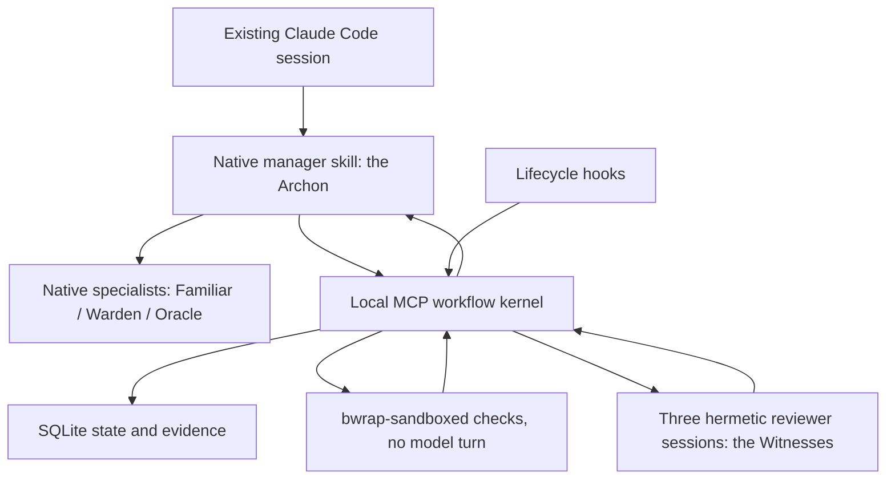

# Archon design — the grimoire

Date: 2026-09-22. Product direction settled; the capability spikes in [the implementation plan](implementation-plan.md) block final implementation claims. This design supersedes the frozen TypeScript Archon (`../archon`, Postgres, 31 roles) and re-derives DevGod's Codex kernel ([`../devgod-recovery/docs/design.md`](../../devgod-recovery/docs/design.md)) for Claude Code. Platform evidence is in [the research record](research/2026-09-22-claude-code-platform.md).

> *In the old traditions an archon held the threads together. This one holds one thread: nothing is called finished until something outside the conversation has watched it pass.*

## 🖤 Product contract

A software professional keeps using their existing Claude Code session. After intentional repository setup, substantive engineering requests activate a native manager workflow. The manager clarifies unresolved product decisions during design, delegates implementation to native subagents, repairs failures, and continues autonomously. Normal completion is an implemented, verified local branch ready for human review.

The failures Archon exists to remove are the same ones DevGod named: repeated permission ceremony, and manual chores caused by the harness's own limitations. Creating tasks, checkpoints, dispatching reviews, reconciling state, waiting out a rate-limit window, retrying recoverable failures — all of that is internal work. Existing Claude Code permissions and real external authorization boundaries still apply; Archon adds no permission layer of its own to routine engineering.

Scope is one professional across local Git repositories on Linux (including WSL2), using their existing Claude subscription login. Publication, deployment, global configuration changes, shared infrastructure, and execution while Claude Code is closed are outside the default delivery contract.

## 🌙 Selected architecture

Python 3.12+, standard-library SQLite, a local stdio MCP service, and **the Claude Code CLI as the only model runtime**. The engine version is recorded, not pinned: `doctor` reports an untested version as a warning with a re-probe instruction, never as a lock (crabgic's own gate froze it out of its host). Models are pinned per role inside Archon's own agent files; the user's root-session model is never rewritten.



The native manager makes engineering judgments. The kernel computes deterministic next actions from the accepted task graph and observed results; it is not another model and it appears to the manager only through status tools.

Two things changed materially from DevGod, and both are simplifications the platform earned:

1. **Checks need no model.** Codex offered a model-free `command/exec`; Claude Code offers an OS sandbox. So the kernel runs each check's argv itself under `bwrap` — network unshared, writable roots limited to the delivery worktree and a private scratch with its own `TMPDIR`, private state masked — supervised by the existing child-subreaper launcher. One fewer round-trip per check, and the termination receipt is the kernel's own.
2. **Reviewers are hermetic by flags, not by config surgery.** A reviewer is `claude -p` with a kernel-issued `--session-id`, `--setting-sources ""`, `--strict-mcp-config`, `--disable-slash-commands`, a four-tool read-only catalog, `dontAsk`, and a generated read-only sandbox settings file. The kernel checks the `system/init` event to prove the catalog and MCP list are what it asked for.

What did *not* change: SQLite is the only authority; a model's say-so never changes state; the final gate needs current checks, three independent approvals, and an unchanged candidate.

## 🕯️ Components and contracts

The package is `archon`. Module ownership follows DevGod's boundaries; the exact signatures live in [the implementation plan](implementation-plan.md).

| Module | Owns | Provenance |
|---|---|---|
| `models.py`, `store.py` | Typed records, validated transitions, SQLite transactions, claims, leases, evidence, events. | Ported verbatim from DevGod; `Policy` widened (see §Verification). |
| `workspace.py` | Repository identity, branch/baseline capture, candidate digests, isolated snapshots, scope comparison, Git sanitization. | Ported; the `.codex` relocation predicate becomes a Claude predicate. |
| `claude_adapter.py`, `launcher.py`, `sandbox.py` | Check execution under `bwrap`, reviewer sessions through `claude -p`, generated permission/sandbox profiles, subreaper supervision, termination receipts, rate-limit signals, structured-output validation. | New adapter behind the unchanged `ExecutionAdapter` protocol; launcher keeps lines 1–176 of DevGod's and swaps the exec target. |
| `verification.py` | Check/reviewer dispatch, bounded jobs, receipts, freshness, gate evaluation, rate-limit pause. | Ported; `thread_id` → `session_id`; adds `paused_until`. |
| `service.py` | start/plan/checkpoint/status/next/verify/wait/resume/recover/cancel. | Ported; adds `wait` next action. |
| `mcp_server.py`, `cli.py` | Native tool interface; `init`, `doctor`, `status`, `uninstall`, `hook`, `mcp`. | Ported; tool names unchanged. |
| `install.py`, `hooks.py` | Managed overlay in the consuming repository, span-preserving JSON edits, manifest, migration from TS-Archon and DevGod, lifecycle hook handlers. | Rewritten targets, ported primitives. |

Plans contain acceptance criteria, task dependencies, specialist roles, write scopes, and verification commands as argv arrays with bounded working directories and timeouts. Results identify the originating invocation, candidate and check-spec digests, artifacts, findings, and next actions. No model result can grant a state transition directly.

## 🗝️ The coven — roles and model routes

DevGod routed Luna / Terra / Sol. Archon routes the Claude family; every route is a project-scoped agent file the manager dispatches by name, and every reviewer is a kernel-launched session the manager never sees from the inside.

| Role | File / route | Model, effort | Dispatched for |
|---|---|---|---|
| **The Archon** (manager) | host conversation + `.claude/skills/archon-manager/SKILL.md` | user's session model; `auto` or `acceptEdits` recommended | Intake, design settlement, delegation, integration, repair coordination, terminal report. |
| **Familiar** (worker) | `.claude/agents/archon-familiar.md` | `sonnet`, `medium` | Clear, bounded implementation packets with acceptance IDs, owned paths, dependencies, checks; focused tests; mechanical refactors; known-path repairs. |
| **Warden** (lead) | `.claude/agents/archon-warden.md` | `opus`, `high` | Architecture reconnaissance, decomposition, cross-component debugging, integration, API/schema/persistence decisions, Familiar escalations. May run independent slices with `isolation: worktree` (passing an explicit base; the worktree branches from the default branch, not HEAD). |
| **Oracle** (escalation) | `.claude/agents/archon-oracle.md` | `fable`, `xhigh` | Evidence-backed hard blockers, material design disagreement, difficult root cause, high-risk security or data-integrity decisions. Fable is opt-in per policy so a Pro plan without it degrades to `opus`/`max`. |
| **The three Witnesses** (reviewers) | kernel sessions, roles `reviewer`, `qa_engineer`, `security_reviewer` | `opus`, `high` (each overridable in `Policy.review_routes`; never Haiku — it did not produce structured output in probes) | Independent assessment of the frozen candidate against the accepted acceptance IDs. Three *distinct* role prompts (DevGod shared one; that gap closes here). |

Escalation is the same ladder: Familiar → Warden when requirements are unclear, when work crosses a public API, schema, persistence, security, or concurrency boundary, or after an unexplained failed repair; Warden → Oracle only with an evidence packet naming attempted approaches, observed failures, affected paths, acceptance IDs, and the unresolved decision. A reviewer never implements; an implementer never reviews. Subagent `memory:` and agent teams are not used in v1.

## 🕸️ Consuming-repository experience

`archon --repo PATH init` installs one manager skill, three agent files, a small marked `CLAUDE.md` section, an `.mcp.json` entry, and a managed region of `.claude/settings.json` holding the `mcp__archon__*` allow rule and the lifecycle hooks. Pre-existing instructions, settings, comments, key order, and unowned files are preserved through span-preserving JSON edits; a manifest at `.archon/native-install.json` records ownership and content hashes so upgrade and removal are idempotent. Setup does **not** touch `permissions.defaultMode`, the root model, or anything under `~/.claude`.

The manager:

1. Reads local instructions, records the goal and accepted constraints, clarifies only unresolved design decisions.
2. Dispatches the Warden for reconnaissance before making more than two local read or search calls, records a practical task graph, and lets the kernel create the delivery branch without discarding user work.
3. Dispatches Familiars with bounded ownership, integrates output, checkpoints completed and remaining work.
4. Calls `verify`. The kernel actually executes checks and launches the three Witnesses.
5. Repairs returned findings and requests fresh evidence automatically. If the kernel reports a rate-limit pause it calls `wait`; it does not ask the user to do anything.
6. Reports the verified branch, actual checks, review conclusions, and remaining limitations under the fixed headings `Outcome`, `Changes`, `Verification`, `Agents`, `Limitations`.

No task packets, review JSON, reviewer identity registration, or queue repair are user prerequisites. `AGENTS.md` is left alone; `CLAUDE.md` is the canonical instruction file, and the installer offers `--migrate` for both the TypeScript Archon overlay and a DevGod overlay.

## 🔮 State continuation

One SQLite database per canonical Git common directory under `$XDG_STATE_HOME/archon/repos/<repo-id>/`, outside every worktree. Runs, tasks, jobs, evidence, checkpoints, and events keep DevGod's states and transitions exactly, with one addition: a verification job may be **`paused`** with `resume_at` when the runtime reports a subscription rate limit (`rate_limit_event` with `status: rejected`, or the `You've hit your … limit` result string). Status then reports `next_action: wait` with the reset time; `wait` blocks for at most 60 seconds per call and the job resumes itself when the window reopens. Budget exhaustion and pauses are never completion.

Lifecycle hooks (`SessionStart[startup|resume|compact]`, `PreCompact`, `SubagentStart`, `SubagentStop`, `Stop`) restore the current checkpoint, record observed subagent events, and request another turn when unblocked, actionable work remains. Continuation is bounded to eight same-session continuations and two identical no-progress actions, which coincides with the engine's own eight-block Stop cap; on `stop_hook_active: true` the hook always yields. `PreCompact` only checkpoints; post-compaction context is injected by `SessionStart` with `source: compact`, which is the channel that actually reaches the model. Hooks never read transcripts, never run project commands, never mark anything verified, and **fail open**: if the kernel is unreachable the session continues and a `systemMessage` says so.

One Claude-only hook is added, because Claude Code hooks can block: a `PreToolUse` guard on `Bash|Edit|Write` denying a short, fixed list of reward-hacking shapes (`--no-verify`, `git push --force*`, deleting files under the plan's test paths, editing `.archon/`, `.claude/agents/archon-*`, or the managed `CLAUDE.md` block outside `init`). It is a dozen patterns with a label on its ceiling, not a shell parser.

## ⚗️ Verification and trust

The candidate identity, snapshot rules, Git sanitization, and staged/unstaged/untracked preservation are DevGod's unchanged. Snapshots relocate `.claude/**`, `CLAUDE.md`, `CLAUDE.local.md`, `AGENTS.md`, `.mcp.json`, and `.claude-plugin/**` into inert review-data files so a reviewer session can read them as evidence but never load them as configuration.

**Checks** execute in the active worktree under a kernel-owned `bwrap` profile: `--unshare-net`, `--unshare-pid`, the filesystem read-only except the worktree and a private scratch, `/tmp` a private tmpfs, `TMPDIR`/`TMP`/`TEMP` pointed at the scratch, `~/.ssh`, `~/.aws`, `~/.gnupg`, `~/.claude`, and Archon's state directory masked, `--die-with-parent`, `--new-session`. The subreaper launcher writes the termination receipt; a check passes only with exit 0, confirmed termination, no timeout, and untruncated logs. Source is hashed before and after. DevGod died eight minutes into its first real run because its policy excluded `/tmp` and `uv` could not write a cache; the scratch-with-`TMPDIR` rule exists for that run, and the acceptance suite includes a real `uv sync` fixture. The profile is a fixed tuple in `sandbox.py`; a check found in repository configuration is a proposal to run *under* the profile, never authority to widen it. `network_access` stays `False`; a project needing package downloads prepares dependencies through the manager's normal tools first.

**Reviews** are three `claude -p` sessions, each launched by the kernel under the subreaper against the frozen snapshot with:

```
claude -p --session-id <uuid> --output-format stream-json --verbose
  --json-schema <ReviewPayload schema> --model <route> --effort <route>
  --tools Read,Grep,Glob,Bash --permission-mode dontAsk --permission-prompts none
  --setting-sources "" --strict-mcp-config --disable-slash-commands
  --settings <generated: allow read-only Bash prefixes, deny Write/Edit/Agent/WebFetch/WebSearch, sandbox read-only>
  --append-system-prompt-file <role prompt> --max-budget-usd <policy> --no-session-persistence
```

with `ARCHON_MANAGED_REVIEW=1` in the environment and the packet JSON on stdin. The kernel rejects the session unless `system/init` reports the requested tool catalog **plus `StructuredOutput`**, which `--json-schema` injects on top of `--tools`, compared as a set because the engine returns it sorted; `mcp_servers` and `skills` both **empty** — they are lists, not counts; and `permissionMode: dontAsk`. A missing `StructuredOutput` is fatal rather than tolerated, because a reviewer without it cannot deliver a verdict at all and would look like a refusal. Structured output is produced by the model calling the internal `StructuredOutput` tool; the role prompt says so explicitly, and a success result with `structured_output: null` is a bounded provider fault. The `ReviewPayload` is validated locally with exact acceptance-ID set equality, evidence references restricted to supplied IDs, and finding paths that resolve inside the snapshot. Reviewer decisions are `approve`, `request_changes`, or `blocked`; unresolved high/critical findings block completion. The gate requires three approving reviews with **distinct session IDs and distinct invocation IDs** — the Claude analogue of DevGod's thread-ID independence proof. Attribution is disabled for every kernel session (`attribution: {commit: "", pr: ""}`) and reviewers never commit anyway.

`--bare` is not used: it refuses OAuth subscription credentials. Reviewer transcripts land under `~/.claude/projects/<snapshot path>/` and are discarded with `--no-session-persistence`.

**An interrupted reviewer is never resumed — for independence, not incapacity.** A resumed reviewer would be a new review wearing the previous one's identity, and three approvals carrying three distinct kernel-issued session ids is exactly what the gate rests on. The kernel relaunches an interrupted reviewer as a new attempt with a new session id, and `--resume` appears nowhere in the adapter.

> This paragraph previously justified the rule by claiming the engine *could not* resume:
> spike S9 at 2.1.278 found no transcript after a `kill -9` and read `num_turns: 1` as a
> silent fresh start. That inference was wrong, and the spike never tested it. Re-run at
> 2.1.280 with a token planted in the killed session, `--resume` returned the token
> verbatim in every run — context *is* recovered. The capability claim is retracted; the
> rule stands on its own reason. Justifying a correct rule with a false fact is how a rule
> gets repealed the day the fact is checked.

Reviewer sessions run under an isolated `CLAUDE_CONFIG_DIR` inside the 0700 control directory, holding a 0600 copy of the credential file which is purged afterwards. Relocation alone would **de-authenticate** the session, since credentials live inside that directory; when no credential file exists the adapter falls back to the user's own directory rather than handing the reviewer an empty one. Suppression of the user configuration tier comes from `--setting-sources ""`, never from moving the directory.

Private state and process provenance protect against accidental or model-authored evidence forgery, not against an arbitrary same-user process. Repository code, tool output, and review prose remain untrusted input. The final gate proves recorded checks and review conditions, not program correctness.

## 🩸 Recovery and autonomy limits

Concurrency, job duration, output size, delegation depth, and retry counts are kernel-owned. Evidence stops are automatically resumable diagnoses, never requests that the user edit state. Genuine host permission requirements propagate with the exact action and reason; Archon never asks approval to create workflow records, dispatch an authorized review, or repair its own metadata. Cancellation stops owned processes and preserves evidence. Delivery ends on a local branch; commits, PRs, merges, and deployment need their own instruction.

## 🪞 Dissent and trade-offs

*A pure plugin with subagent reviewers* (project-companion's shape) is smaller and was field-proven at 1.3k lines. It was seriously considered. It cannot prove reviewer independence (a subagent's output is prose the manager integrates), cannot survive the manager's context being closed mid-verification, and cannot pause a check for a rate-limit window. Archon keeps the kernel for those three things and nothing else; the iron rule that no further mechanism enters without a run that needed it is adopted from companion.

*The Agent SDK in-process* would give typed hooks and `canUseTool`. It bundles its own engine version (crabgic saw three engines on one host), and crabgic measured `canUseTool` shadowed by any allow rule. The CLI under the subreaper already yields receipts. The `ExecutionAdapter` seam is kept so an SDK adapter can be added without touching the kernel.

*Agent teams and the `Workflow` tool* are experimental and duplicate the kernel. Declined.

*The TypeScript Archon's Postgres, HMAC review identity, 31 roles, and 46 skills* were audited inert or self-locking (`../archon/STATUS.md`). Their honest-residual doctrine and the "prose can release a soft hold, never a hard gate" Stop structure survive as design rules; nothing else is ported.

## 🕯️ Blocking acceptance and capability proof

Implementation is complete only with evidence for:

- Idempotent install/upgrade/removal preserving user `CLAUDE.md`, `.claude/settings.json` comments and order, `.mcp.json`, and agent edits.
- A consuming-repo run completing two dependent tasks through native specialists without operator-authored workflow data.
- Actual `bwrap`-sandboxed checks proving network egress and out-of-root writes are blocked while `uv`/`npm` caches under the scratch succeed.
- Three hermetic reviewer sessions whose `system/init` proves the catalog, with distinct session IDs, producing validated structured output.
- Rejection of missing, forged, stale, mutated, failed, incomplete, or null-structured-output evidence.
- Automatic repair followed by fresh verification and review.
- Recovery across dispatch, ingestion, compaction, service interruption, and a simulated rate-limit pause, without losing scope or duplicating accepted effects.
- Observable cancellation, waits, budgets, and actionable blockers.
- A verified local branch with no unsolicited publication or global changes.
- An authenticated live smoke run and a native manager-conversation run, reported separately from simulated fault tests.

The twelve platform pitfalls in the research record are P0 spikes; any UNRESOLVED spike restricts downstream code to the literal confirmed forms.

---

<div align="center">🕯️ <em>The kernel keeps the receipts. The witnesses keep their distance. The archon keeps going.</em> 🕯️</div>
